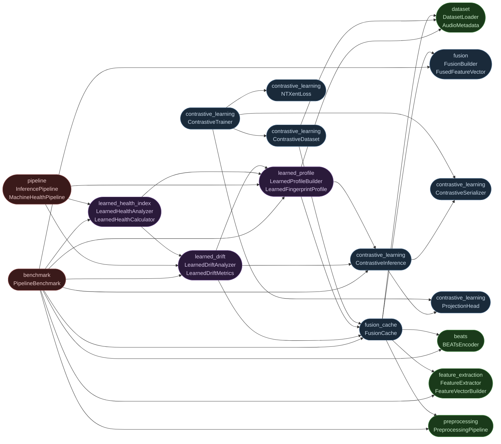

# Module Dependencies

Directed dependency graph of the major source modules.
An arrow `A --> B` means module A imports from module B.

## Dependency Layers

| Layer | Modules | Depends on |
|---|---|---|
| **Leaf** | `preprocessing`, `feature_extraction`, `beats`, `dataset` | External libraries only |
| **Fusion** | `fusion`, `fusion_cache` | Leaf layer |
| **Contrastive** | `ProjectionHead`, `NTXentLoss`, `ContrastiveInference`, `ContrastiveTrainer`, `ContrastiveDataset`, `ContrastiveSerializer` | Fusion layer |
| **Profile / Drift / Health** | `learned_profile`, `learned_drift`, `learned_health_index` | Fusion + Contrastive layers |
| **Orchestration** | `pipeline`, `benchmark` | All layers above |
