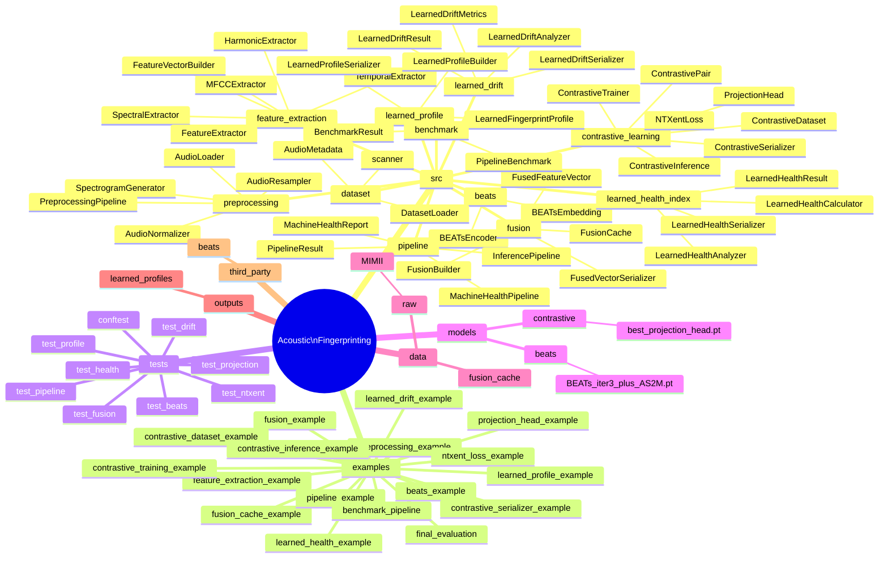

# Repository Structure

Mindmap of the repository, expanded to show every implemented source module.

```mermaid
mindmap
  root((Acoustic\nFingerprinting))
    src
      preprocessing
        AudioLoader
        AudioResampler
        AudioNormalizer
        SpectrogramGenerator
        PreprocessingPipeline
      feature_extraction
        MFCCExtractor
        SpectralExtractor
        TemporalExtractor
        HarmonicExtractor
        FeatureExtractor
        FeatureVectorBuilder
      beats
        BEATsEncoder
        BEATsEmbedding
      fusion
        FusionBuilder
        FusedFeatureVector
        FusionCache
        FusedVectorSerializer
      contrastive_learning
        ContrastiveDataset
        ContrastivePair
        ProjectionHead
        NTXentLoss
        ContrastiveTrainer
        ContrastiveInference
        ContrastiveSerializer
      learned_profile
        LearnedProfileBuilder
        LearnedFingerprintProfile
        LearnedProfileSerializer
      learned_drift
        LearnedDriftAnalyzer
        LearnedDriftMetrics
        LearnedDriftResult
        LearnedDriftSerializer
      learned_health_index
        LearnedHealthAnalyzer
        LearnedHealthCalculator
        LearnedHealthResult
        LearnedHealthSerializer
      pipeline
        InferencePipeline
        MachineHealthPipeline
        PipelineResult
        MachineHealthReport
      benchmark
        PipelineBenchmark
        BenchmarkResult
      dataset
        DatasetLoader
        AudioMetadata
        scanner
    examples
      preprocessing_example
      feature_extraction_example
      beats_example
      fusion_example
      fusion_cache_example
      contrastive_dataset_example
      ntxent_loss_example
      projection_head_example
      contrastive_training_example
      contrastive_inference_example
      contrastive_serializer_example
      learned_profile_example
      learned_drift_example
      learned_health_example
      pipeline_example
      benchmark_pipeline
      final_evaluation
    tests
      conftest
      test_beats
      test_fusion
      test_projection
      test_ntxent
      test_profile
      test_drift
      test_health
      test_pipeline
    models
      beats
        BEATs_iter3_plus_AS2M.pt
      contrastive
        best_projection_head.pt
    data
      raw
        MIMII
      fusion_cache
    outputs
      learned_profiles
    third_party
      beats
```
