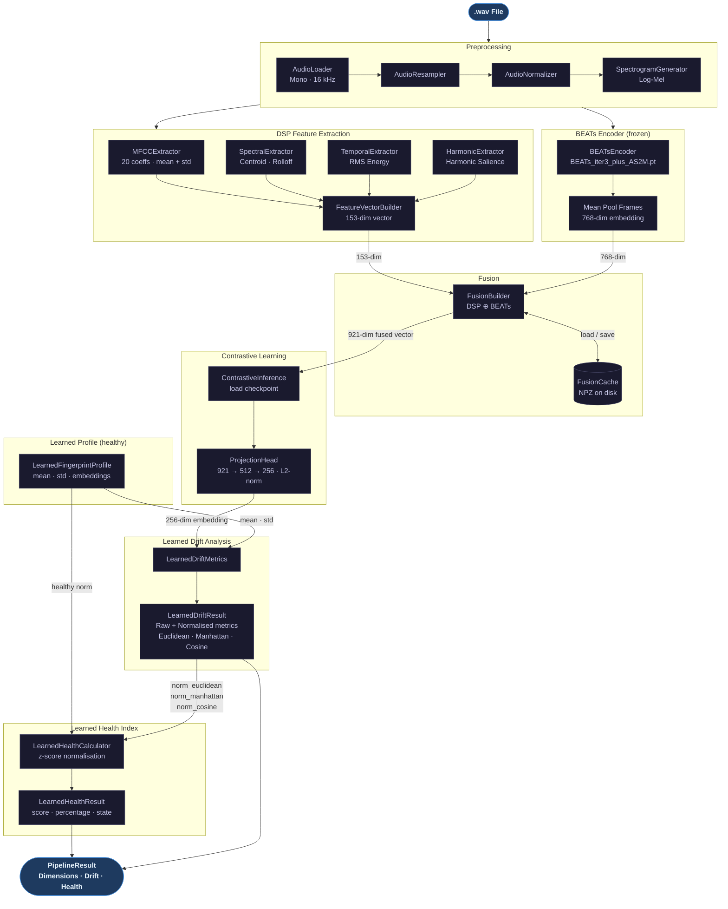

# System Architecture

Complete inference pipeline from raw audio to machine health report.

## Dimension Summary

| Stage | Output |
|---|---|
| DSP Feature Extraction | 153-dim float32 vector |
| BEATs Encoder | 768-dim float32 embedding |
| Fusion Vector | 921-dim float32 (DSP ⊕ BEATs) |
| ProjectionHead | 256-dim L2-normalised embedding |

## Health State Bands

| Score | State | Meaning |
|---|---|---|
| 90–100 | EXCELLENT | Within normal healthy variation |
| 75–89 | GOOD | Slightly outside typical healthy variation |
| 50–74 | WARNING | Statistically significant deviation |
| 0–49 | CRITICAL | Extreme outlier relative to healthy distribution |
