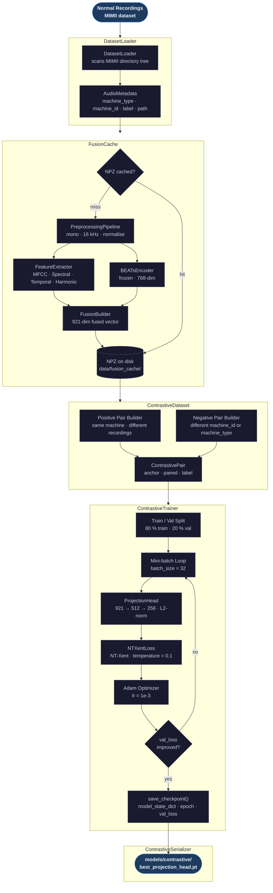

# Training Pipeline

Contrastive training flow from raw normal recordings to a saved ProjectionHead checkpoint.

## Training Configuration

| Parameter | Default | Description |
|---|---|---|
| `epochs` | `2` | Number of full passes over training pairs |
| `batch_size` | `32` | Pairs per mini-batch |
| `learning_rate` | `1e-3` | Adam learning rate |
| `temperature` | `0.1` | NT-Xent softmax temperature |
| `val_split` | `0.2` | Fraction of pairs reserved for validation |

## Pair Construction Rules

| Pair Type | Rule |
|---|---|
| Positive | Same `machine_type` and `machine_id`, different recording |
| Negative | Different `machine_id` or different `machine_type` |
