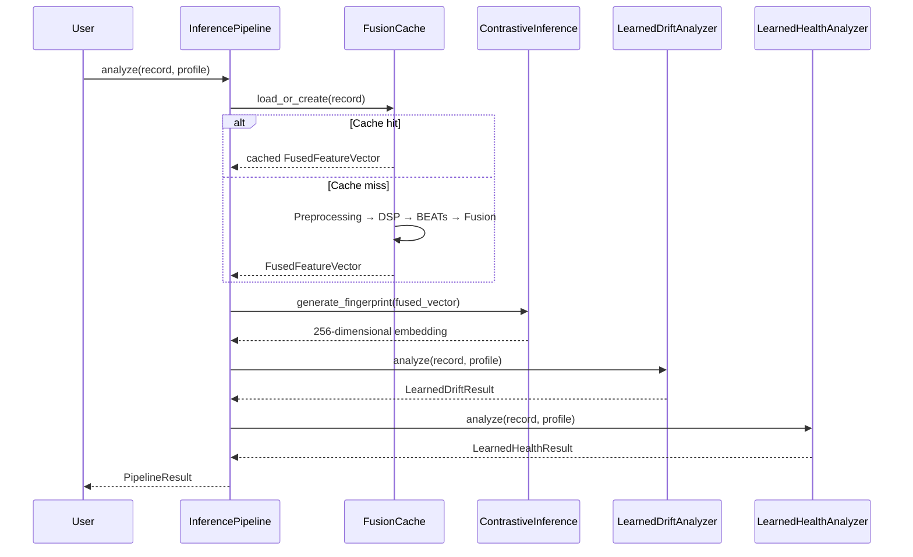

# Inference Workflow

```mermaid
sequenceDiagram
    participant User
    participant InferencePipeline
    participant FusionCache
    participant ContrastiveInference
    participant LearnedDriftAnalyzer
    participant LearnedHealthAnalyzer

    User->>InferencePipeline: analyze(record, profile)

    InferencePipeline->>FusionCache: load_or_create(record)

    alt Cache hit
        FusionCache-->>InferencePipeline: cached FusedFeatureVector
    else Cache miss
        FusionCache->>FusionCache: Preprocessing → DSP → BEATs → Fusion
        FusionCache-->>InferencePipeline: FusedFeatureVector
    end

    InferencePipeline->>ContrastiveInference: generate_fingerprint(fused_vector)
    ContrastiveInference-->>InferencePipeline: 256-dimensional embedding

    InferencePipeline->>LearnedDriftAnalyzer: analyze(record, profile)
    LearnedDriftAnalyzer-->>InferencePipeline: LearnedDriftResult

    InferencePipeline->>LearnedHealthAnalyzer: analyze(record, profile)
    LearnedHealthAnalyzer-->>InferencePipeline: LearnedHealthResult

    InferencePipeline-->>User: PipelineResult
```
